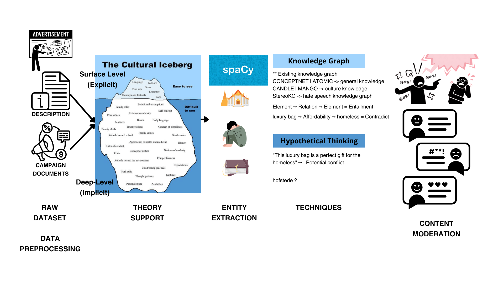

# Content Moderations in Advertisements through Cultural Lens

## 🚀 Table of Contents
- [Content Moderations in Advertisements through Cultural Lens](#content-moderations-in-advertisements-through-cultural-lens)
  - [🚀 Table of Contents](#-table-of-contents)
  - [📰 News](#-news)
  - [Introduction](#introduction)
    - [Research Questions (Tentative)](#research-questions-tentative)
    - [Hypotheses (Tentative)](#hypotheses-tentative)
  - [Cultural Terminology](#cultural-terminology)
    - [Cultural Awareness](#cultural-awareness)
    - [Cultural Knowledge](#cultural-knowledge)
    - [Cultural Sensitivity](#cultural-sensitivity)
    - [Cultural Misunderstanding](#cultural-misunderstanding)
    - [Cultural Misconception](#cultural-misconception)
  - [What is the Culture Iceberg Theory?](#what-is-the-culture-iceberg-theory)
    - [Aspect Comparison: Surface Level vs. Deep-Level](#aspect-comparison-surface-level-vs-deep-level)
  - [Methodology](#methodology)
  - [Papers](#papers)
    - [Literature Review](#literature-review)
    - [Cultural Theory](#cultural-theory)
    - [Cultural Knowledge](#cultural-knowledge-1)
    - [Emotions](#emotions)
    - [Hate Speech \& Toxicity](#hate-speech--toxicity)
    - [Cultureal Bias \& Social Bias](#cultureal-bias--social-bias)
    - [Evaluation](#evaluation)
  - [Citation](#citation)

## 📰 News
- [2025/03/13] Experiment 02 - Augment Cultural Knowledge to synthetic advertisment contents. 
- [2025/02/05] Experiment 01 - Parametric Knowledge Synthetic dataset from advertisment contents.

## Introduction
Social media platforms are widely popular and frequently serve as channels for advertisements. Increasingly, these advertisements rely on AI-driven content moderation to detect and filter harmful content such as hate speech, misinformation, and explicit material. While such advancements have improved online safety, current moderation systems often lack a cultural sensitivity lens—critical for understanding how diverse audiences interpret information.

To address this gap, we propose a **Cultural (Sensitivity) Content Moderation Framework** based on the Cultural Iceberg Theory. This framework moves beyond traditional harmful content detection by analyzing both:
- **Surface-Level Cultural Elements (Explicit Knowledge):** Observable traits like language, symbols, and clothing.
- **Deep-Level Cultural Implications (Implicit Meanings):** Subtle aspects like power dynamics, historical sensitivities, and emotional norms.

By integrating commonsense cultural knowledge with bias detection, our approach aims to ensure that AI moderation not only identifies overt harmful content but also flags culturally insensitive representations that might reinforce stereotypes, misunderstandings, or unintentional offenses.

### Research Questions (Tentative)
- **R1:** To what extent do existing AI moderation models fail to recognize implicit cultural biases, and what are the key factors contributing to these failures?
- **R2:** How can AI-driven content moderation systems be enhanced to detect and address cultural insensitivity, rather than just harmful content?
- **R3:** What role does the Cultural Iceberg Theory play in distinguishing surface-level explicit cultural elements from deep-level implicit cultural meanings in advertisements?

### Hypotheses (Tentative)
- **H1:** LLM-based context-aware reasoning will improve AI moderation’s ability to detect historically and socially sensitive themes, thereby reducing the risk of unintended cultural bias in advertisements.
- **H2:** Combining explicit (knowledge graph-based) and implicit (hypothetical thinking) cultural analysis will lead to a more balanced and contextually aware AI moderation system, mitigating over-censorship while improving fairness across diverse audiences.
- **H3:** The Cultural Iceberg Theory can enhance AI moderation by providing a structured framework that differentiates explicit cultural markers from implicit cultural meanings, reducing misclassification errors in advertisements.

## Cultural Terminology

### Cultural Awareness
- **Definition:** Recognition that different cultures exist and influence people's behaviors, beliefs, and values.
- **Example:** Realizing that bowing is a common greeting in Japan, while handshakes are preferred in the West.

### Cultural Knowledge
- **Definition:** A deeper understanding of different cultures, including their history, values, traditions, and communication styles.
- **Example:** Understanding that in some Middle Eastern cultures, showing the sole of your shoe is considered disrespectful.

### Cultural Sensitivity
- **Definition:** The ability to interact with and respect different cultures without offending or imposing one’s own cultural values.
- **Example:** Avoiding jokes or stereotypes that might be offensive to a particular cultural group.

### Cultural Misunderstanding
- **Definition:** Situations where differences in cultural norms or expectations lead to confusion or incorrect assumptions, often due to a lack of awareness.
- **Example:** A Western manager mistakenly assuming that an employee from an East Asian background is uninterested in leadership roles because they do not actively self-promote.

### Cultural Misconception
- **Definition:** A false or inaccurate belief about a culture, often based on stereotypes, biases, or limited exposure.
- **Example:** Thinking that all people from a certain culture eat spicy food or that a particular nationality is inherently rude.

## What is the Culture Iceberg Theory?
The Culture Iceberg Theory is a powerful analogy that illustrates how much of culture is invisible and intangible. It emphasizes that:
- **Surface-Level (Explicit):** Represents the visible and observable aspects of culture that outsiders first notice.
- **Deep-Level (Implicit):** Represents the unseen, subconscious aspects that influence behaviors, values, and ways of thinking.

Developed by anthropologist **Edward T. Hall in 1976**, this theory underscores that values and beliefs are deeply ingrained, and understanding them is essential for effective cross-cultural communication and content moderation.

### Aspect Comparison: Surface Level vs. Deep-Level
| **Aspect**             | **Surface Level (Explicit)**                         | **Deep-Level (Implicit)**                             |
|------------------------|------------------------------------------------------|-------------------------------------------------------|
| **Visibility**         | Easily seen, observed, or described                  | Hidden, requires deep understanding                   |
| **Detection Method**   | Directly recognizable via rules or knowledge graphs  | Requires hypothesis-driven context analysis           |
| **Examples**           | Clothing, food, language, symbols                    | Power dynamics, historical sensitivities, emotional norms |
| **LLM Role**           | Uses ConceptNet/Knowledge Graphs to map explicit elements | Uses hypothesis thinking to extract objects and analyze cultural depth |

## Methodology
Our methodology integrates both explicit and implicit analysis to enhance AI-driven content moderation through cultural sensitivity. The process involves several key stages:

1. **Data Collection:**  
   - Gathering advertisements and social media content from diverse cultural backgrounds.
   - Curating datasets that include both overt cultural markers and subtle contextual cues.

2. **Explicit Cultural Analysis:**  
   - Utilizing knowledge graphs (e.g., ConceptNet) to identify visible cultural elements such as language, symbols, and attire.
   - Applying rule-based systems to map and tag explicit content features.

3. **Implicit Cultural Analysis:**  
   - Employing hypothesis-driven techniques to extract and analyze hidden cultural meanings.
   - Integrating contextual reasoning models to assess power dynamics, historical sensitivities, and emotional norms that might not be immediately apparent.

4. **Integration and Moderation:**  
   - Combining results from explicit and implicit analyses to generate a comprehensive cultural sensitivity score.
   - Implementing feedback loops where human moderators validate and refine AI decisions, ensuring reduced misclassification and over-censorship.

5. **Evaluation:**  
   - Benchmarking the system against existing moderation frameworks.
   - Conducting user studies to assess cultural fairness and accuracy.

The workflow and integration of these components are visually summarized in the figure below:



## Papers
Below is a curated list of key papers that have contributed to the field, along with their associated resources. Feel free to explore these works for more insights:

- **ACL-2023: Title of the Paper**  
  [paper](#) | [code](#) | *Authors: Author1, Author2, Author3*
- **Example Paper 2**  
  [paper](#) | [code](#) | *Authors: AuthorA, AuthorB*

### Literature Review
This section provides a comprehensive review of existing literature on AI moderation, cultural sensitivity, and related frameworks. It highlights:
- Trends and challenges in AI content moderation.
- The role of cultural sensitivity in improving automated systems.
- Comparative analyses of explicit vs. implicit cultural elements in research.
  
_Additional detailed summaries and comparisons of each work will be added as the literature review is expanded._


### Cultural Theory
- **2024 Cultural Differences Affecting Advertising**
  [Paper](https://irjems.org/Volume-3-Issue-10/IRJEMS-V3I10P130.pdf) | 
- **2000 Culture, Emotion, and Well-being: Good Feelings in Japan and the United States**
  [Paper](https://web.stanford.edu/~hazelm/publications/2000%20Kitayama,%20Markus,%20&%20Kurokawa_Culture,emotion%20and%20well-being.pdf)
- **1998 Transcultural Care: A guide for Health Care Professionals.**  
  [Paper](https://ieneproject.eu/download/Outputs/intercultural%20model.pdf)

### Cultural Knowledge
- **2024 Meta-Toxic : Enhancing LLM-based Hatred and Toxicity Detection with Meta-Toxic Knowledge Graph**
  [Paper](https://arxiv.org/pdf/2412.15268) 
- **2023 Culturally Aware Natural Language Inference**
  [Paper](https://aclanthology.org/2023.findings-emnlp.509.pdf)
- **2024 CultureBank: An Online Community-Driven Knowledge Base Towards Culturally Aware Language Technologies**
  [Paper](https://arxiv.org/pdf/2404.15238)
- **2024 BLEND: A Benchmark for LLMs on Everyday Knowledge in Diverse Cultures and Languages**
  [Paper](https://proceedings.neurips.cc/paper_files/paper/2024/file/8eb88844dafefa92a26aaec9f3acad93-Paper-Datasets_and_Benchmarks_Track.pdf)
- **2024 MANGO : Cultural Commonsense Knowledge for Intercultural Dialogues**
  [Paper](https://arxiv.org/pdf/2402.10689) [Code](https://mango.mpi-inf.mpg.de/)
- **2023 CANDLE : Extracting Cultural Commonsense Knowledge at Scale**
  [Paper](https://dl.acm.org/doi/pdf/10.1145/3543507.3583535) [Code](https://candle.mpi-inf.mpg.de/)
- **2025 NORMAD: A Framework for Measuring the Cultural Adaptability of Large Language Models**
  [Paper](https://arxiv.org/pdf/2404.12464)
- **2023 GlobalOpinionQA : Towards Measuring the Representation of Subjective Global Opinions in Language Models**
  [Paper](https://arxiv.org/abs/2306.16388)

### Emotions
- **2020 GoEmotions: A Dataset of Fine-Grained Emotions**  
  [Paper](https://aclanthology.org/2020.acl-main.372.pdf)

### Hate Speech & Toxicity
- **2025 Multi3Hate: Multimodal, Multilingual, and Multicultural Hate Speech Detection with Vision–Language Models**
  [Paper](https://arxiv.org/pdf/2411.03888#page=15.45)
- **2024 Exploring Cross-Cultural Differences in English Hate Speech Annotations: From Dataset Construction to Analysis**  
  [paper](https://aclanthology.org/2024.naacl-long.236v2.pdf) 
- **2024 Can LLMs Recognize Toxicity? A Structured Investigation Framework and Toxicity Metric**
  [Paper](https://arxiv.org/pdf/2402.06900)
- **2024 Don’t Go To Extremes: Revealing the Excessive Sensitivity and Calibration Limitations of LLMs in Implicit Hate Speech Detection**
  [Paper](https://arxiv.org/pdf/2402.11406)
- **2024 Socio-Culturally Aware Evaluation Framework for LLM-Based Content Moderation*
  [Paper](https://arxiv.org/pdf/2412.13578)
  
### Cultureal Bias & Social Bias
- **2024 Having Beer after Prayer? Measuring Cultural Bias in Large Language Models**
  [Paper](https://arxiv.org/pdf/2305.14456)
- **2023 Cultural Concept Adaptation on Multimodal Reasoning**
  [Paper](https://aclanthology.org/2023.emnlp-main.18.pdf)
- **2020 SOCIAL BIAS FRAMES: Reasoning about Social and Power Implications of Language**
  [Paper](https://aclanthology.org/2020.acl-main.486.pdf)
  
### Evaluation
- **2024 CulturalTeaming: AI-Assisted Interactive Red-Teaming for Challenging LLMs’ (Lack of) Multicultural Knowledge**
  [Paper](https://arxiv.org/pdf/2404.06664)
- **2024 Evaluating Cultural and Social Awareness of LLM Web Agents**
  [Paper](https://arxiv.org/pdf/2410.23252)
  
## Citation 
If you find this work useful, please consider citing our paper:
```
@misc{tt2025comads,
      title={Content Moderations in Advertisements through Cultural Lens}, 
      author={Todsavad Tangtortan},
      year={2025},
}
```